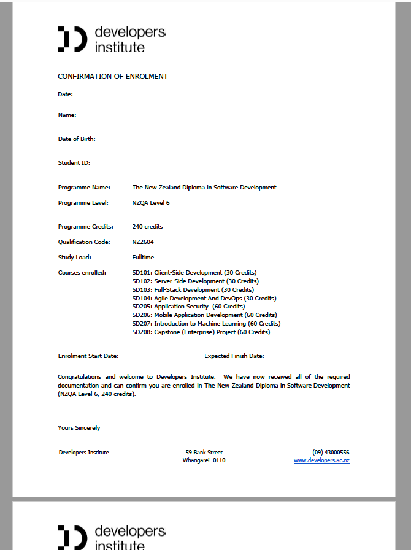
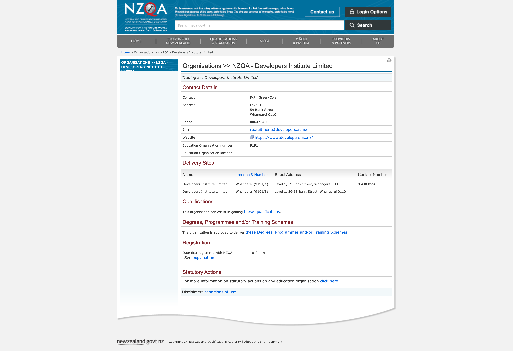

# Setup accounts

## Miro

Being a remote-first company, we need a whiteboard that we can use from anywhere. We use a tool called Miro for this,

Sign up for a [Miro](https://miro.com/) account with Miro's [free education plan](https://miro.com/education-whiteboard/). [Sign up here](https://miro.com/contact/education/) using your `@developersinstitute.co.nz` Google Account.
- Select 'student' as your role, and then fill in the rest of your details.
- For 'Where do you study/work' select `Online education`
- For 'Educational Institution' type `Developers Institute`
- For 'What will you use Miro for' type `For planning software projects. For example drawing mockups, creating flow diagrams, participating in group retrospectives`
- For 'Employment status' load a screenshot of the first page of the official 'confirmation of enrolment' pdf document you received after completing your enrolment at Developers Institue. It should look something like this  

- For 'Accreditation confirmation' load this image file 

It may take a day or so for Miro to process your account signup.

## Frontend Masters

You will need a Frontend Masters account from week 2. However it's good to sign up and have a look around before then, as there are other courses that might interest you.

1. Go to [Getting Started with JavaScript, v2](https://frontendmasters.com/courses/getting-started-javascript-v2/), and click the red _Get Free Access Now_ button
2. Create an account, using your `@developersinstitute.co.nz` email address

**Note:** You can get a 6 month free subscription to Frontend Masters from the [GitHub Student Developer Pack](https://education.github.com/pack). We will use free courses as part of the course, but with a premium subscription you have access to hundreds of high quality classes.

## Loom

We share a lot of videos in Loom. Create a Loom account so you can leave comments and feedback on videos that we share.

- [Loom](https://www.loom.com) - create an account on Loom with your Developers Institute email address. Ensure you are logged in when you are watching videos.

