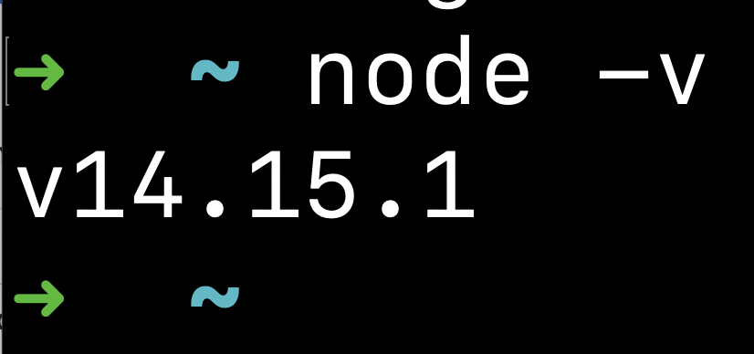

# Install software

Watch [Introduction to VS Code, the command line, and GitHub](https://www.loom.com/share/9c662808140e4b8893f7e0424847f6b1) for an overview of some of the tools we will be installing to complete our web development

## Version Control

Git is an industry-standard tool for tracking changes to files, and allowing developers to collaborate on code together. It's like a shared Google Doc for code. We will be using it every day.

[Install git by visiting the git website](https://git-scm.com/downloads), downloading and installing the git application. 

If you are on a mac, watch [Installing applications on your Mac](https://www.loom.com/share/1325f420d7aa4871ac5fba2e721b4422?from_recorder=1) if you need help installing this software.

## Programming tools

### Node

[Node.js](https://nodejs.org/en/) is a JavaScript runtime, meaning you can run JavaScript outside of a web browser. It's used extensively in web development to both build web-servers, and to run tools on your mac computer to help with web development. You can run local servers, automate annoying tasks and a bunch of other helpful things. You need to install it, as we use a lot of tools that depend on Node.js.

Visit the [Node website](https://nodejs.org/en/). Download and install the LTS version of Node onto your operating system.

After installing node to your operation system, open your terminal and type: `node -v`, it should display the version of Node you have installed. Note: your version may be different to the example in the screenshot

#### Example:

## Visual Studio Code

Visual Studio Code is a text editor with developer super powers. We use it to write our code, and it provides a lot of helpful features that make our lives much easier as a developer. You will be writing all of your code into Visual Studio Code (VS Code).

You need to VS Code as your code editor at Developers Institute, even if you are familiar with other tools.

- Download and install [Visual Studio Code](https://code.visualstudio.com/), the open-source code editor.
- Make sure it's installed to your Applications folder
- Customize VS-Code by installing the following extensions:
  - [ ] [Live Server extension](https://marketplace.visualstudio.com/items?itemName=ritwickdey.LiveServer)
  - [ ] [Prettier extension](https://marketplace.visualstudio.com/items?itemName=esbenp.prettier-vscode)
  - [ ] [Live Share Extension Pack](https://marketplace.visualstudio.com/items?itemName=MS-vsliveshare.vsliveshare-pack)
