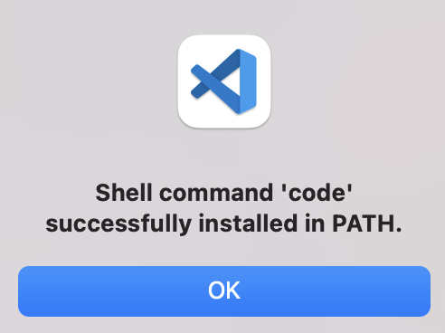
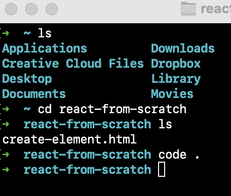

# Customise VS Code

## Launching Visual Studio Code from the command line

You can run VS Code from the terminal just by typing the word 'code' after following the instructions below:

- Launch VS Code.
- Open the Command Palette (cmd + shift + p) and type these words into the search bar `shell command` to find the ``` Shell Command: Install 'code' command in PATH``` command.

  

Click on that command, if everything is working correctly you should see the following message:



## Next, lets open your terminal

- Navigate to the folder you wish to open (e.g type `ls` to get a list of all your folders and files, `cd ~/my-projects/project1` depending on which file you want to edit in VS Code. 

- Once you've navigated to that folder or file just type the command `code .` to launch it in VS Code, this is a great shortcut to open files to edit directly from the command line. 

### Example:



#### Why do you have to put the . after the command 'code' ? 

you have to include the `.` after the command code so that it opens folders and files relative to where you are in your directory. If you just type the word `code` on its own it will open a blank VS Code window in your root directory instead.
